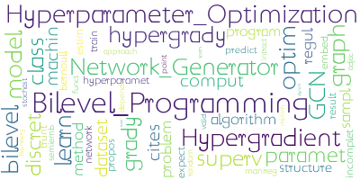
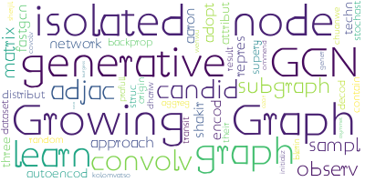
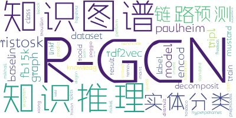
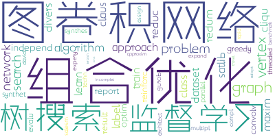

# 2019 spring semester

---

- **Date:** 2019.09.01

- **Reporter:** Edward

- **Title:** Test

- **Keywords:**
 

(wanna know how we generate this word cloud? you can visit this <a href="https://github.com/3riccc/wordcloud_for_bnusss">github page</a>)

- **Abstract:** Graph neural networks (GNNs) are a popular class of machine learning models whose major advantage is their ability to incorporate a sparse and discrete dependency structure between data points. Unfortunately, GNNs can only be used when such a graph-structure is available. In practice, however, real-world graphs are often noisy and incomplete or might not be available at all. With this work, we propose to jointly learn the graph structure and the parameters of graph convolutional networks(GCNs) by approximately solving a bilevel program that learns a discrete probability distribution on the edges of the graph. This allows one to apply GCNs not only in scenarios where the given graph is incomplete or corrupted but also in those where a graph is not available. We conduct a series of experiments that analyze the behavior of the proposed method and demonstrate that it outperforms related methods by a significant margin.

- **Slide link:** http://210.31.72.204/f/500

<!-- ---

- **Date:** 2019.04.15

- **Reporter:** Chen Mengyuan

- **Title:** GENERATIVE GRAPH CONVOLUTIONAL NETWORK FOR GROWING GRAPHS

- **Keywords:**
 

- **Abstract:** Modeling generative process of growing graphs has wide ap- plications in social networks and recommendation systems, where cold start problem leads to new nodes isolated from ex- isting graph. Despite the emerging literature in learning graph representation and graph generation, most of them can not handle isolated new nodes without nontrivial modifications. The challenge arises due to the fact that learning to gener- ate representations for nodes in observed graph relies heav- ily on topological features, whereas for new nodes only node attributes are available. Here we propose a unified genera- tive graph convolutional network that learns node represen- tations for all nodes adaptively in a generative model frame- work, by sampling graph generation sequences constructed from observed graph data. We optimize over a variational lower bound that consists of a graph reconstruction term and an adaptive Kullback-Leibler divergence regularization term. We demonstrate the superior performance of our approach on several benchmark citation network datasets.

- **Slide link:** http://210.31.72.204/f/494

---

- **Date:** 2019.04.08

- **Reporter:** Xin Ruyue

- **Title:** Modeling Relational Data with Graph Convolutional Networks

- **Keywords:**
 

- **Abstract:** Knowledge graphs enable a wide variety of applications, in- cluding question answering and information retrieval. De- spite the great effort invested in their creation and mainte- nance, even the largest (e.g., Yago, DBPedia or Wikidata) remain incomplete. We introduce Relational Graph Convo- lutional Networks (R-GCNs) and apply them to two standard knowledge base completion tasks: Link prediction (recovery of missing facts, i.e. subject-predicate-object triples) and en- tity classification (recovery of missing entity attributes). R- GCNs are related to a recent class of neural networks operat- ing on graphs, and are developed specifically to deal with the highly multi-relational data characteristic of realistic knowl- edge bases. We demonstrate the effectiveness of R-GCNs as a stand-alone model for entity classification. We further show that factorization models for link prediction such as DistMult can be significantly improved by enriching them with an en- coder model to accumulate evidence over multiple inference steps in the relational graph, demonstrating a large improve- ment of 29.8% on FB15k-237 over a decoder-only baseline.

- **Slide link:** http://210.31.72.204/f/487

---

- **Date:** 2019.04.01

- **Reporter:** Wang Shuo

- **Title:** GCN, GAT, GraphSAGE 框架回顾及其 PyG 复现

- **Slide link:** http://210.31.72.204/f/488

---

- **Date:** 2019.03.25

- **Reporter:** Liu Jing

- **Title:** Combinatorial Optimization with Graph Convolutional Networks and Guided Tree Search

- **Keywords:**
 

- **Abstract:** We present a learning-based approach to computing solutions for certain NP- hard problems. Our approach combines deep learning techniques with useful algorithmic elements from classic heuristics. The central component is a graph convolutional network that is trained to estimate the likelihood, for each vertex in a graph, of whether this vertex is part of the optimal solution. The network is designed and trained to synthesize a diverse set of solutions, which enables rapid exploration of the solution space via tree search. The presented approach is evaluated on four canonical NP-hard problems and five datasets, which include benchmark satisfiability problems and real social network graphs with up to a hundred thousand nodes. Experimental results demonstrate that the presented approach substantially outperforms recent deep learning work, and performs on par with highly optimized state-of-the-art heuristic solvers for some NP-hard problems. Experiments indicate that our approach generalizes across datasets, and scales to graphs that are orders of magnitude larger than those used during training.

- **Slide link:** http://210.31.72.204/f/486 -->

